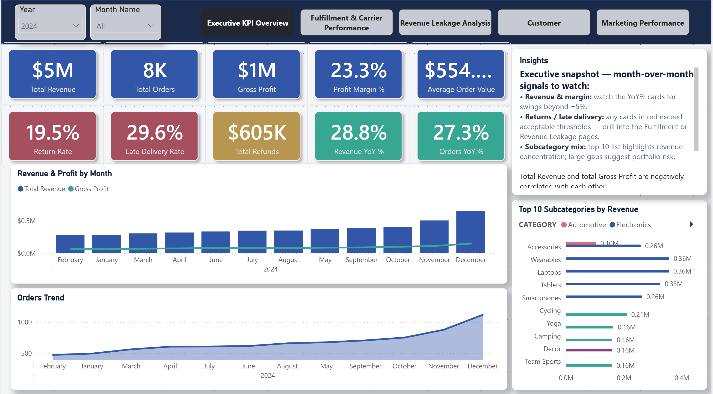
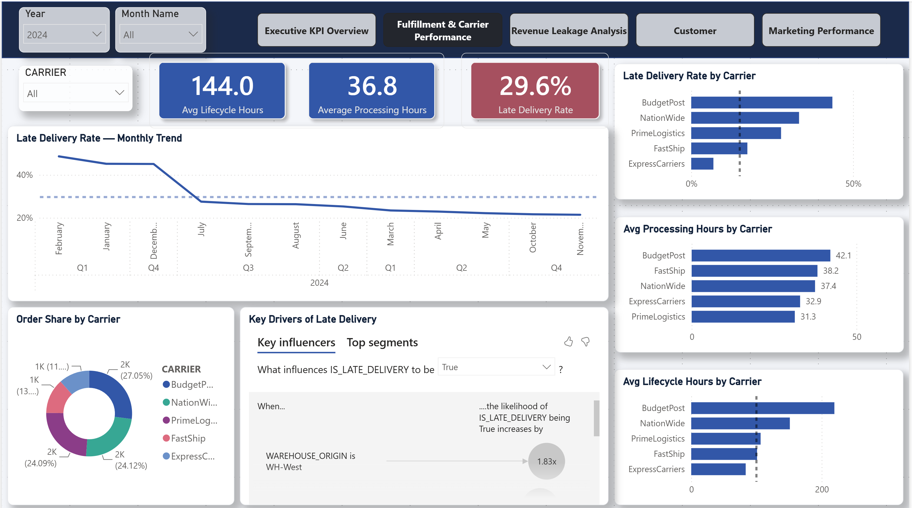
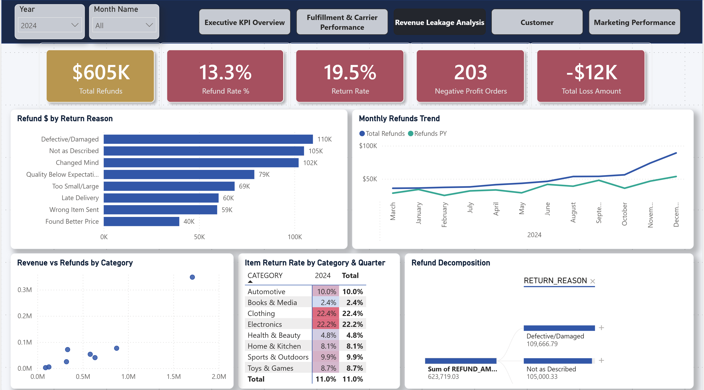
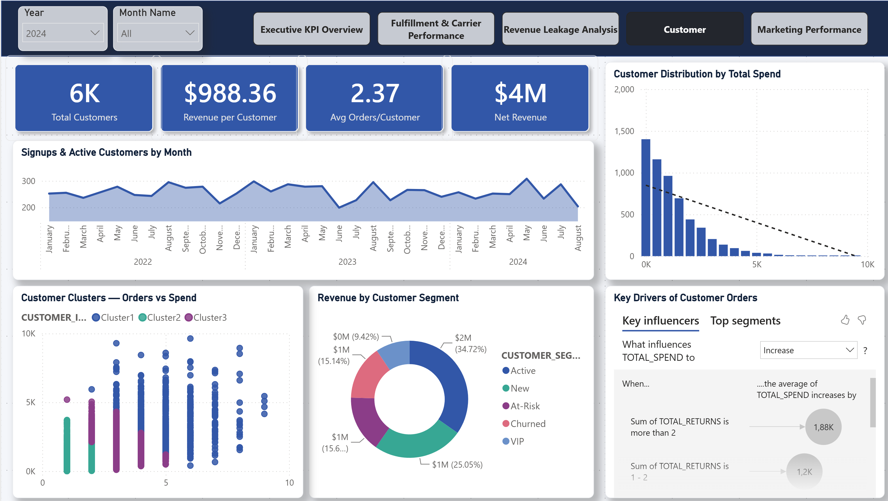
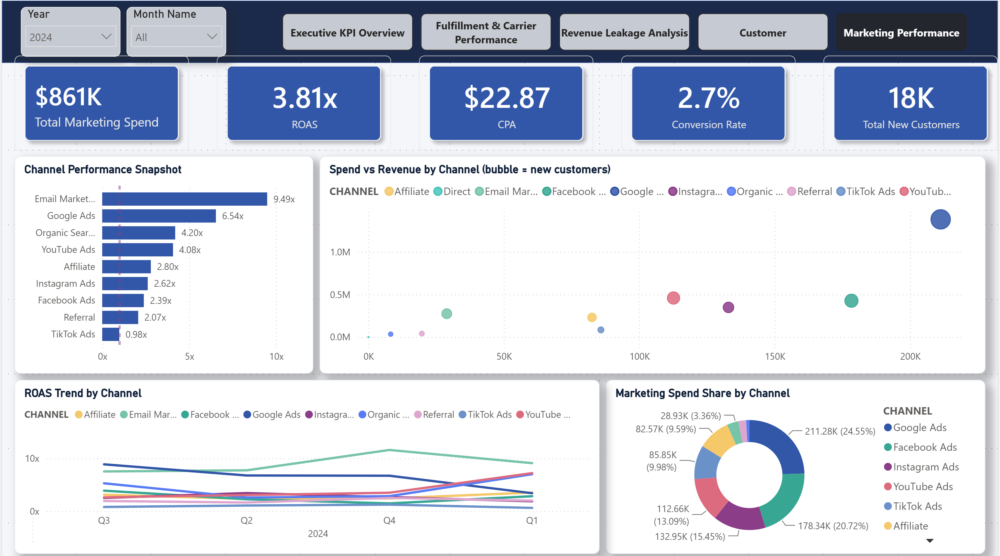

# NovaMart — E-Commerce Operations: Bottleneck Analysis & Revenue Optimization

> An end-to-end analytics project that traces **166,000+ records** across the full order-to-delivery lifecycle of a mid-size US e-commerce company, pinpoints where money leaks out of operations, **proves each bottleneck is statistically significant**, and quantifies a **$2.01M annual improvement opportunity** — surfaced in a 5-page interactive **Power BI** dashboard.


-blueviolet)




---

## Table of Contents

- [The Business Problem](#the-business-problem)
- [Headline Results](#headline-results)
- [Top 5 Findings](#top-5-findings)
- [The Power BI Dashboard](#the-power-bi-dashboard)
- [Financial Impact](#financial-impact)
- [Statistical Validation](#statistical-validation)
- [Architecture & Data Pipeline](#architecture--data-pipeline)
- [Repository Structure](#repository-structure)
- [Tools & Skills Demonstrated](#tools--skills-demonstrated)
- [How to Reproduce](#how-to-reproduce)
- [The Dataset](#the-dataset)
- [Recommendations](#recommendations)
- [Limitations & Next Steps](#limitations--next-steps)

---

## The Business Problem

**NovaMart** is a mid-size US e-commerce company selling across 8 product categories via 45 third-party sellers (Jan 2023 – Dec 2024). Like many growing retailers, it faced three intertwined symptoms:

- **Inconsistent delivery performance** — a stubbornly high late-delivery rate
- **Rising returns and refunds** eating into margin
- **Unclear marketing ROI** — spend was growing faster than attributable revenue

This project answers the questions an operations VP actually cares about: **Where exactly is the lifecycle breaking? How much is it costing us? And what should we fix first?**

---

## Headline Results

KPIs as shown on the Power BI **Executive Overview** cards (Year = 2024 filter applied):

| Metric | Value | | Metric | Value |
|---|---|---|---|---|
| Total Revenue | **$5M** | | Return Rate | **19.5%** |
| Total Orders | **8.4K** | | Late Delivery Rate | **29.6%** |
| Gross Profit | **$1M** | | Total Refunds | **$605K** |
| Profit Margin | **23.3%** | | Revenue YoY | **+28.8%** |
| Avg Order Value | **$554** | | Orders YoY | **+27.3%** |

> <sub>These are the figures displayed on the dashboard cards, which round to the nearest unit and use net/valid-date DAX measures. The precise gross revenue from the marts layer is **$4.67M** for 2024 and **$8.28M** across both years, and the raw 2024 rates work out to ~29.4% late / ~19.6% return — small differences that stem from the dashboard's measure definitions.</sub>

**Dataset scale:** 15,000 orders · 166,381 total rows · 12 interconnected tables · ~$8.3M gross revenue over 24 months.

---

## Top 5 Findings

Each finding below was discovered in SQL/EDA, **validated with a statistical test** (see [Statistical Validation](#statistical-validation)), and translated into dollars (see [Financial Impact](#financial-impact)).

### 1. WH-West is the real warehouse bottleneck — not where you'd guess
WH-West has a **44-hour median processing time** (vs. 12–15h at the best hubs) and a **49.8% late-delivery rate** — nearly double the network average. Power BI's *Key Influencers* confirms an order originating from WH-West is **1.83× more likely to be delivered late**. Mann–Whitney U: **p < 0.001, Cohen's d = 0.66 (medium)**.

### 2. The fulfillment tail lives in transit, not approval
Median lifecycle stage durations expose where time is lost:

| Stage | Median | P90 | P95 |
|---|---|---|---|
| Approval | 5h | 23h | 36h |
| Processing & Shipping | 21h | 87h | 125h |
| **In Transit** | **83h** | **185h** | **211h** |

The widening gap between median and P90 at each stage is where the "stuck orders" hide.

### 3. BudgetPost collapses every winter
The BudgetPost carrier's median transit time jumps to **220 hours in winter** (Dec–Feb) vs. ~144–150h the rest of the year — a **74-hour seasonal penalty**. Mann–Whitney U: **p < 0.001, d = 1.38 (large)**. ExpressCarriers (~37–43h year-round) is unaffected.

### 4. Weekend orders stall at approval
Weekend orders take a **median 14 hours longer to approve** than weekday orders — a staffing/automation gap, not a systems gap. Mann–Whitney U: **p < 0.001, d = 1.71 (large effect)**.

### 5. Late deliveries are associated with more returns
Late-delivered orders return at **21.96%** vs **17.98%** for on-time orders across the full order set. On the validated test population (n = 14,009, with impossible-date records excluded) the lift is **+2.1pp** and statistically significant (Chi-Square, **p = 0.004**) — but the effect size is **negligible** (Cramér's V = 0.02). In short, lateness is a *detectable but practically small* driver of returns; its financial weight comes from compounding with refund and support costs, not from a large per-order effect.

> **Marketing, separately,** is the single largest opportunity: budget is concentrated in low-ROAS channels while **Email Marketing returns 9.4× ROAS** — a **$1.40M** reallocation opportunity (see dashboard page 5).

---

## The Power BI Dashboard

A 5-page report built directly on the Snowflake analytical marts. Each page is designed around the principle *"title every chart as a finding, not a description,"* with slicers for **Year**, **Month**, and page-level dimensions (Carrier, Category, Channel).

### Page 1 — Executive KPI Overview
Revenue, profit, margin, AOV, return & late-delivery rates with YoY signals, monthly revenue/profit and order trends, top subcategories by revenue, and a written executive insight panel.


### Page 2 — Fulfillment & Carrier Performance
The operational heart of the analysis: average lifecycle/processing hours, late-delivery monthly trend, order share by carrier, late-delivery rate and processing/lifecycle hours **by carrier**, plus a **Key Influencers** visual that quantifies what drives `IS_LATE_DELIVERY` (WH-West → 1.83×).



### Page 3 — Revenue Leakage Analysis
Where margin escapes: total refunds, refund/return rates, negative-profit orders, refund $ by return reason, monthly refund trend, revenue-vs-refunds by category, and an **item return-rate heatmap by category × quarter** (Clothing 22.4%, Electronics 22.2% lead).



### Page 4 — Customer Analytics
Customer base health: revenue per customer, avg orders/customer, spend distribution (Pareto), **K-means customer clusters** (orders vs spend), revenue by segment (Active / New / At-Risk / Churned / VIP), and Key Influencers on customer order behavior.



### Page 5 — Marketing Performance
Spend efficiency: total spend, blended ROAS (3.81×), CPA, conversion rate, channel performance ranking (Email Marketing 9.4× ROAS leads), spend-vs-revenue bubble chart, ROAS trend by channel, and spend share by channel — the basis for the reallocation recommendation.



---

## Financial Impact

Every bottleneck translated into an annual dollar figure and prioritized by **impact × fix complexity**. Full methodology in [`sql/03_EDA/08_financial_impact_quantification.ipynb`](sql/03_EDA/08_financial_impact_quantification.ipynb).

| Bottleneck | Annual Impact | Fix Complexity | Recommended Fix | Priority |
|---|---|---|---|---|
| Marketing budget misallocation | **$1.40M** | Low | Reallocate spend to high-ROAS channels | 🔴 HIGH |
| Customer LTV loss from poor experience | **$593.0K** | High | Holistic CX improvement | 🔴 HIGH |
| Late deliveries → excess returns | **$17.2K** | Medium | Improve carrier selection & warehouse ops | 🔴 HIGH |
| Slow warehouse (WH-West) | $1.3K | High | Operations audit, process improvement | 🟡 MEDIUM |
| Support costs from late deliveries | $670 | Medium | Reduce late deliveries (root cause) | 🟡 MEDIUM |
| Weekend approval staffing gap | $236 | Medium | Weekend staffing or automation | 🟡 MEDIUM |
| **Total quantified annual impact** | **~$2.01M** | | | |

**Quick wins** (low-complexity, immediately actionable): **$1.40M** — the marketing reallocation alone.

---

## Statistical Validation

Findings were not accepted on the strength of a chart. Each was tested with the **non-parametric Mann–Whitney U test** (fulfillment durations are right-skewed, so a t-test would be inappropriate) or **Chi-Square** for categorical associations, with effect sizes reported.

| Bottleneck | Test | Sample Sizes | Difference | p-value | Effect Size | Verdict |
|---|---|---|---|---|---|---|
| Weekend approval delay | Mann–Whitney U | Weekend 3,981 / Weekday 10,028 | +14.0h (median) | < 0.001 | d = 1.71 (Large) | ✅ Significant |
| BudgetPost winter delays | Mann–Whitney U | Winter 970 / Other 2,801 | +74.0h (median) | < 0.001 | d = 1.38 (Large) | ✅ Significant |
| WH-West processing | Mann–Whitney U | WH-West 1,885 / Others 12,124 | +25.0h (median) | < 0.001 | d = 0.66 (Medium) | ✅ Significant |
| Late delivery → returns | Chi-Square | n = 14,009 | +2.1pp (return rate) | 0.004 | V = 0.02 (Negligible) | ✅ Significant |

> <sub>Test samples reflect the **valid-dates subset** (impossible-date records excluded for time-based analysis), so each *n* is slightly below the raw EDA counts (e.g. WH-West 1,885 of 1,921 total orders). Effect-size bands follow the thresholds used in the notebook — Cohen's *d*: 0.2 small / 0.5 medium / 0.8 large; Cramér's *V*: <0.1 negligible / <0.3 small. The late-delivery → returns result is statistically significant only because *n* is large; its practical association is negligible.</sub>

Details and visualizations in [`sql/03_EDA/07_statistical_validation.ipynb`](sql/03_EDA/07_statistical_validation.ipynb).

---

## Architecture & Data Pipeline

The project follows the **Medallion architecture** (Bronze → Silver → Gold), implemented as three Snowflake schemas — the same staging → marts pattern modern data teams use in production.

```
 Excel sources (12 files)
        │   python/xlsx_to_snowflake.ipynb
        ▼
┌──────────────────┐   01_staging/        ┌──────────────────┐   02_staging_and_marts/   ┌──────────────────┐
│  novamart_raw    │  profiling + QA      │ novamart_staging │  cleaned, typed, enriched │ novamart_marts   │
│  (Bronze)        │ ───────────────────► │   (Silver)       │ ────────────────────────► │   (Gold)         │
│  raw uploads     │  validity checks     │  stg_orders,     │  lifecycle durations,     │ mart_order_      │
│                  │  statistical profile │  stg_order_items │  margins, late flags      │ complete (+ EDA) │
└──────────────────┘                      └──────────────────┘                           └──────────────────┘
                                                                                                  │
                                                          Python EDA · stats · financials ◄───────┤
                                                          Power BI (DirectQuery/Import) ◄──────────┘
```

**Entity relationship map:**

```
customers ──┐
            ├──► orders ──┬──► order_items ──► products
sellers ────┘            │
                         ├──► shipping_logistics
                         ├──► returns_cancellations ──► products
                         ├──► customer_reviews ──► products
                         ├──► support_tickets
                         └──► cancellations
inventory_snapshots ──► products
marketing_campaigns ──► (links via customers.acquisition_channel)
```

The Gold layer's centerpiece is **`mart_order_complete`** — one denormalized row per order joining seller context, customer context, item profitability, return status, and review data. ~80% of the analysis builds on this single table.

---

## Repository Structure

```
novamart-ecommerce-analysis/
│
├── README.md                          ← You are here
├── NovaMart_Project_Roadmap.md        ← The 7-phase analyst playbook this project follows
├── requirements.txt
│
├── data/
│   ├── 00_DATA_DICTIONARY.md          ← Full schema & column dictionary for all 12 tables
│   └── 01–12 *.xlsx                    ← Raw source data (166K+ rows)
│
├── python/
│   └── xlsx_to_snowflake.ipynb        ← Load: Excel → Snowflake raw schema
│
├── sql/
│   ├── 01_staging/
│   │   ├── 01_completeness_profiling.ipynb
│   │   ├── 02_validity_checks.ipynb
│   │   ├── 03_statistical_profiling.ipynb
│   │   └── Data Quality Report         ← 1-page DQ assessment with remediation decisions
│   ├── 02_staging_and_marts/
│   │   ├── 04_staging_tabels.ipynb     ← Build cleaned staging tables (Silver)
│   │   └── 05_analytical_marts.ipynb   ← Build mart_order_complete (Gold)
│   └── 03_EDA/
│       ├── 06_exploratory_data_analysis.ipynb
│       ├── 07_statistical_validation.ipynb
│       ├── 08_financial_impact_quantification.ipynb
│       ├── 09_validation_cells.ipynb
│       ├── *.png / *.csv               ← Exported charts & result tables
│       └── financial_impact_report.md
│
└── dashboard_images/                  ← Power BI dashboard screenshots (5 pages)
```

---

## Tools & Skills Demonstrated

| Skill | Where in the project | Why it matters |
|---|---|---|
| **SQL (Snowflake)** — window functions, `QUALIFY`, CTEs, `PERCENTILE_CONT` | Staging & marts notebooks | The core analytics-engineering toolkit |
| **Medallion / dimensional modeling** | raw → staging → marts pipeline | Shows production-grade data architecture |
| **Data quality assessment** | `01_staging/` + DQ Report | Demonstrates professional maturity, not just chart-making |
| **Python EDA** — pandas, matplotlib, seaborn | `06_exploratory_data_analysis.ipynb` | Distribution analysis beyond SQL |
| **Statistical hypothesis testing** — Mann–Whitney U, Chi-Square, Cohen's d | `07_statistical_validation.ipynb` | Separates analysts from "people who make charts" |
| **Financial impact modeling** | `08_financial_impact_quantification.ipynb` | The #1 skill operations leaders hire for |
| **Power BI** — multi-page report, DAX KPIs, Key Influencers, K-means clustering | `dashboard_images/` | Self-service BI & data storytelling |
| **Technical documentation** | This README, DQ Report, roadmap | Communication = career leverage |

---

## How to Reproduce

### Prerequisites
- A **Snowflake** account
- **Python 3.10+** with Jupyter
- **Power BI Desktop** (to open/refresh the report against Snowflake)

### 1. Install dependencies
```bash
pip install -r requirements.txt
# requirements: snowflake-connector / pandas (see requirements.txt)
```

### 2. Configure credentials
Create a `.env` file in the project root (already git-ignored) with your Snowflake connection:
```dotenv
SNOWFLAKE_ACCOUNT=your_account
SNOWFLAKE_USER=your_user
SNOWFLAKE_PASSWORD=your_password
SNOWFLAKE_WAREHOUSE=your_wh
SNOWFLAKE_DATABASE=NOVAMART
```

### 3. Run the pipeline in order
1. `python/xlsx_to_snowflake.ipynb` — loads the 12 Excel files into `novamart_raw`
2. `sql/01_staging/01–03` — profiling & data quality assessment
3. `sql/02_staging_and_marts/04` then `05` — build staging tables, then `mart_order_complete`
4. `sql/03_EDA/06 → 07 → 08` — EDA, statistical validation, financial impact
5. Open the Power BI report and point it at the `novamart_marts` schema; refresh.

---

## The Dataset

Two years (Jan 2023 – Dec 2024) of simulated NovaMart operations: **166,381 rows across 12 interconnected tables**, with **intentionally embedded** operational bottlenecks and realistic data-quality issues. Full column-level documentation in [`data/00_DATA_DICTIONARY.md`](data/00_DATA_DICTIONARY.md).

| # | Table | Rows | Role |
|---|---|---|---|
| 01 | orders | 15,000 | Central fact — root of all joins |
| 02 | order_items | 29,668 | Line-item detail |
| 03 | products | 480 | Product dimension |
| 04 | customers | 6,200 | Customer dimension |
| 05 | sellers | 45 | Seller/vendor dimension |
| 06 | shipping_logistics | 91,850 | Granular tracking events |
| 07 | returns_cancellations | 3,187 | Returns & refunds |
| 08 | customer_reviews | 8,686 | Voice of customer |
| 09 | inventory_snapshots | 8,400 | Weekly stock (80 products) |
| 10 | marketing_campaigns | 240 | Channel spend & performance |
| 11 | support_tickets | 2,250 | Customer service |
| 12 | cancellations | 375 | Order cancellations |

**Data quality, handled up front** (see the [Data Quality Report](sql/01_staging/Data%20Quality%20Report)):
- **~2% NULL `customer_id`** → *flagged*, retained for revenue, excluded from customer-level metrics (~$165K revenue preserved)
- **~1% impossible dates** (delivered < ordered) → *flagged and excluded* from time-based analysis only
- **~12% NULL `return_received_date`** → expected (returns in transit), no action
- **62.75% inventory stockout rate** → escalated as an operational finding, not a data bug
- All primary keys unique; all foreign keys intact (zero orphan records)

---

## Recommendations

Prioritized by ROI (high impact + low effort first):

1. **Reallocate marketing budget** toward high-ROAS channels (Email Marketing at 9.4×). *Low effort, ~$1.40M opportunity.*
2. **Re-route BudgetPost winter volume** to a reliable carrier (e.g. ExpressCarriers/PrimeLogistics). *Low effort — a contract/routing change — eliminates a 74-hour seasonal penalty.*
3. **Audit WH-West fulfillment operations** — the single largest internal driver of late delivery (1.83×). *Higher effort, structural.*
4. **Close the weekend approval gap** with automation or weekend staffing — removes a 14-hour median delay.
5. **Invest in CX retention** to stem the ~$593K LTV loss from poor delivery/return experiences.

---

## Limitations & Next Steps

- Inventory analysis is partial — only **80 of 480 products** (16.7%) are tracked in snapshots.
- The dataset is **simulated**; absolute dollar figures illustrate methodology rather than a live P&L.
- **Next:** A/B test the carrier and staffing changes; build a predictive model to flag at-risk orders *before* they ship late; and stand up an automated alerting pipeline on the marts layer.

---

*Built as a portfolio-grade demonstration of the full analytics lifecycle — from raw ingestion and data governance through statistical validation, financial quantification, and executive-ready Power BI storytelling.*
